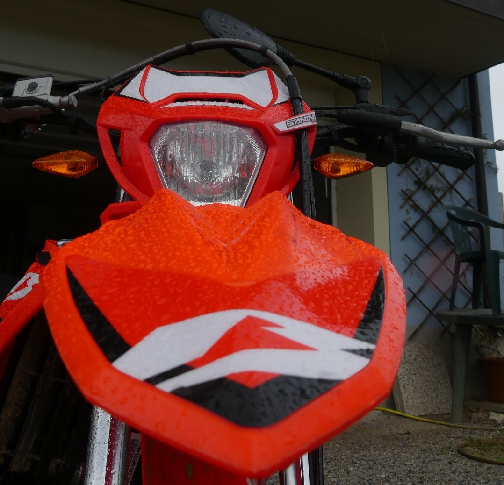

# 🎯 Portfolio Personale – Andrea Francavilla

**Una web application moderna e completamente responsive** che presenta il mio portfolio, i miei hobby, i miei progetti e una collezione di giochi sviluppati. Il sito è utilizzato come CV interattivo e vetrina dei miei progetti.



---

## 📋 Contenuti del Portfolio

### Home
- Presentazione personale animata
- Icone interattive per le diverse competenze (Web Dev, Bash, C-like, Python)
- Accesso rapido alle sezioni principali

### Chi Sono (About)
- Informazioni personali
- Percorso scolastico e formativo (ITIS E. Majorana di Grugliasco)
- Interessi e passioni

### Hobby
- **Moto**: Passione per l'enduro, dettagli sulla Beta RR 50, esperienze di guida e officina
- **Musica**: Generi preferiti (trap, hip-hop, rap, drill), artisti favoriti, playlist Spotify
- **Sport**: Passione sportiva e attività fisiche

### Contatti
- Modulo contatto funzionante con EmailJS
- Link ai social media (Instagram, GitHub)

---

## Funzionalità Principali

### Generazione e Gestione Utenti

* Generazione di utenti casuali con parametri personalizzabili
* Selezione del numero di risultati, genere e nazionalità
* Supporto a richieste multiple e aggiornamento dinamico dei dati

### Filtri e Interazioni Avanzate

* Slider per il numero di utenti generati
* Filtro per genere (uomo, donna, tutti)
* Selezione multipla delle nazionalità con icone e bandiere
* Ricerca testuale per nome ed email
* Ordinamento dei risultati

### UX e Stato dell’Applicazione

* Sistema di **preferiti persistenti**
* Paginazione dinamica dei risultati
* Modale dettagliata per ogni utente
* Visualizzazione ed esportazione dei dati in formato JSON

### Analisi dei Dati

* Statistiche aggregate in tempo reale:

  * distribuzione per genere
  * età media
  * conteggio utenti caricati

### Tema e Accessibilità

* Tema **Light / Dark / System**
* Design *mobile-first*
* Interfaccia ottimizzata per desktop, tablet e smartphone

---

## 🛠️ Tecnologie Utilizzate

| Categoria              | Tecnologia                                           |
| ---------------------- | ---------------------------------------------------- |
| **Frontend**           | HTML5 semantico, CSS3, JavaScript (ES6+)             |
| **Framework CSS**      | Bootstrap 5.3                                        |
| **Framework JavaScript**| jQuery                                               |
| **Email**              | EmailJS                                              |
| **Design System**      | Bootstrap Icons, Google Fonts (Comic Relief, Inter)  |
| **Versionamento**      | Git / GitHub                                         |

---

## Architettura e Struttura

La struttura del progetto è organizzata per una facile manutenzione e scalabilità:

```
Portfolio/
├── index.html                  # Homepage principale
├── html/
│   ├── chisono.html           # Pagina "Chi Sono"
│   ├── hobby.html             # Hub pagine hobby
│   ├── moto.html              # Hobby - Moto
│   ├── musica.html            # Hobby - Musica
│   ├── sport.html             # Hobby - Sport
│   ├── games.html             # Collezione giochi
│   └── contact.html           # Modulo contatti
├── css/
│   └── styles.css             # Stili personalizzati
├── js/
│   ├── theme.js               # Gestione tema
│   ├── hover.js               # Effetti hover
│   ├── smoothScroll.js        # Scroll fluido
│   ├── contact.js             # Form contatti
├── assets/
│   ├── img/                   # Immagini e favicon
│   ├── games/                 # 25+ giochi web
│   └── projects/              # File downloadabili
├── README.md                  # Questo file
└── LICENSE.md                 # Licenza MIT
```

---

## 🚀 Come Eseguire il Progetto

### Metodo 1: Apertura diretta in browser
1. Clona la repository:
   ```bash
   git clone https://github.com/francavillaandrea/Portfolio.git
   ```
2. Apri `index.html` in un browser moderno

### Metodo 2: Con Live Server (consigliato)
Per evitare problemi CORS con i18n:

```bash
npm install -g live-server
cd Portfolio
live-server
```
2. Apri il file `index.html` in un browser moderno

### Server di sviluppo (consigliato)

Per evitare eventuali problemi CORS:

```bash
npm install -g live-server
live-server
```

---

## Responsive Design

L’app è progettata con approccio **mobile-first**, adattandosi automaticamente ai vari dispositivi.

| Dispositivo | Comportamento                                   |
| ----------- | ----------------------------------------------- |
| Smartphone  | Layout compatto a colonna singola               |
| Tablet      | Griglia adattiva e controlli affiancati         |
| Desktop     | Pannello di controllo completo e griglia estesa |

---

## Possibili Estensioni Future

- 🎮 Aggiungere più giochi interattivi
- 📊 Portfolio di progetti con GitHub API integration
- 🔐 Autenticazione utente per area riservata
- 📈 Analytics e tracking visite

---

## Autore

**Andrea Francavilla** | Studente I.I.S Giancarlo Vallauri, Fossano (CN)  
[GitHub](https://github.com/francavillaandrea) • [Instagram](https://www.instagram.com/andrea.francavilla/)

